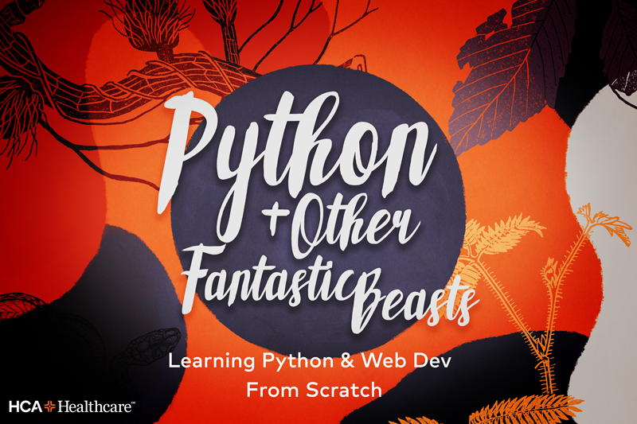

# Python & Other Fantastic Beasts

Learning Python & Web Development From Scratch

---

Hello and thank you for expressing interest in this course! **Python & Other Fantastic Beasts** is designed to take you from zero-to-code, in a fun, no-assumptions, practical manner. Moreover, we aim to teach you how Python can be used in conjunction with other languages like SQL, HTML, CSS, & JavaScript, to create rich and engaging applications.

## Table of Contents

- [Motivation for the Course](#motivation)
- [Syllabus](#syllabus)
- [Details and Rationale of Course Structure](#details-about-the-course)
- [Your Instructors](#your-instructors)

## Motivation

I personally feel that Python is a wonderful first language, even for a seasoned programmer, it is an invaluable tool to add to your tool-belt. Python's tiny and expressiveness syntax give it, and you, a soon to be Pythonista, a leg up in creating just about _anything_ you can imagine. Whether you aspire to be an Analyst, a Data Scientist, or a Software Developer, I think there's something for just about everyone in this course, and I hope you'll consider coming along for the ride.

### Receive a Written Recommendation and Endorsement from JR and Edmund

Upon completing the course and passing a final assessment, students will receive a written recommendation from myself or Derek in addition to a Python Skill Endorsement via LinkedIn from both JR Allen and Edmund Jackson.

## Syllabus

1. Module One: Setup, Syntax, and Basics
    - Class One

        Students will install Python3.6^, configure a terminal for their given operating system (Terminal for MAC, Cygwin for Windows), and install VSCode.

        Class will finish with executing your first Python Script.

    - Class Two

        Students will learn how to interact with the Python REPL, and explore the Data
        Types that comprise the Python Programming Language. Students will also explore
        control structures and composition of expressions in Python, culminating
        in developing a Command Line Interface.

    - Class Three

        Students will explore Python Data Structures like dictionaries, lists, and the
        underlying Python Classes dictionaries and lists inherit from to enable their functionality. Additionally, students will learn to utilize functions, list-comprehensions, and generators. The class ends with leveraging built Python
        functions/data structures to solve classic Computer Science problems.

### More To Be Announced Soon

## Details About The Course

**Python & Other Fantastic Beasts** will be taught over the course of one hour lecture/guided coding sessions. To ensure that we are continuing to provide value, respecting everyone's time, and to gauge interest regularly, classes will be released in modules of three. This will allow us, the instructors of the course, time to prepare materials and
assist those who are stuck between sessions.

## Your Instructors

---

### Warren

### Derek

### Phillip
